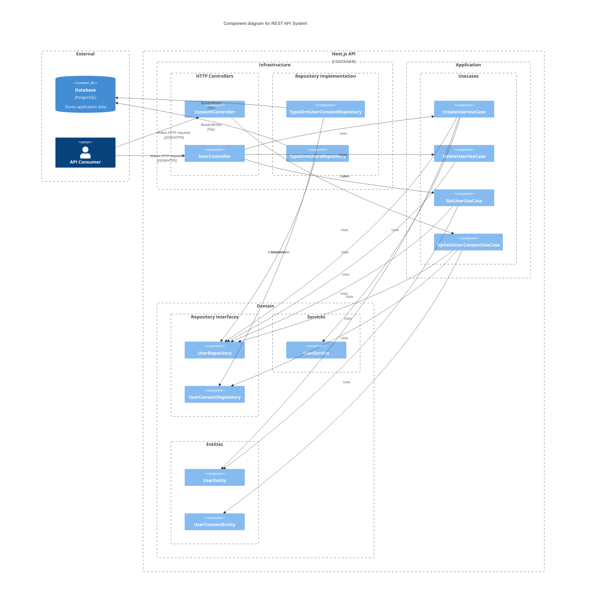
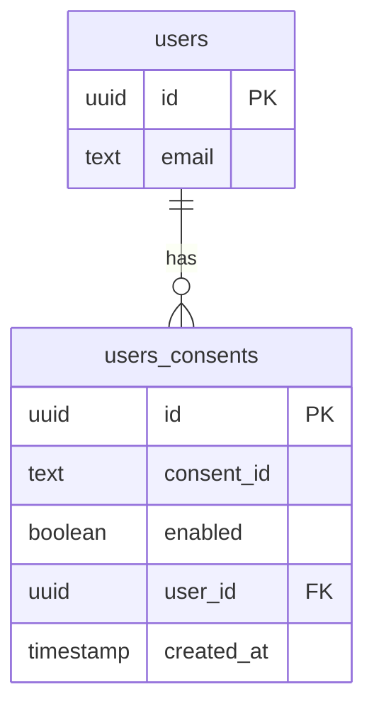

# didomi-test-preference-center-service

## Running the API

```bash
cp .env.example .env

npm ci

docker-compose up db # In a separate terminal or --detach
npm run start:dev
```

## Tests

### Running the tests

```bash
# all tests
$ npm run test

# unit tests
$ npm run test:unit

# integration tests
$ npm run test:e2e

# test coverage (93% line coverage 💪)
$ npm run test:cov
```

The approach of testing was unit tests the application layer, mocking repositories, and integration tests using a real database connection.

```
## unit tests

UpdateUserConsentUseCase
  ✓ should not create a consent with invalid user id
  ✓ should not create a consent with invalid consent id
  ✓ should create a consent

CreateUserUseCase
  ✓ should not create a user with invalid email
  ✓ should not create a user with already existing email
  ✓ should create a user

DeleteUserUseCase
  ✓ should delete a user
  ✓ should delete a user with an invalid, but not call repository

## integration tests

users
  ✓ should be able to create a user with valid email
  ✓ should not be able to create a user with invalid email
  ✓ should not be able to create a user with an already registered email
  ✓ should be able to get a user
  ✓ should not be able to get a user with invalid id
  ✓ should not be able to get a user that does not exist
  ✓ should be able to delete a user
  ✓ should not be able to delete a user with invalid id
  ✓ should not be able to delete a user that does not exist

consents
  ✓ should be able to create a consent
  ✓ should not be able to create a consent with an invalid user
  ✓ should not be able to create a consent with a user that does not exist
  ✓ should not be able to create a consent with an invalid consent
```

## API Docs

### Swagger Docs

<http:localhost:3001/docs>

### OpenAPI Spec

<http://localhost:3001/docs-json>

## Architecture & Design

### System Context Diagram



### Code Design

This Nest.js application is modular monolith with a clean architecture layered architecture. Each module of the application is divided into the following layers:

- **Domain Layer**: Contains the core of the application business logic of the application. Contains entities, domain errors, repositories interfaces, and domain services.

- **Application Layer**: Contains the use cases of the application, responsible for orchestrating the domain layer and the infrastructure layer.

- **Infrastructure Layer**: Contains the implementation of the repositories interfaces, database connection, and the presentation layer (controllers). In this case, the presentation layer is implemented using Nest.js HTTP controllers and the repositories are implemented using TypeORM/PostgreSQL.

Each module is divided in the layers above.

### Modules

- **User Module**: Contains the user agregate root, and every functionality related to user.

- **Consent Module**: Contains the consent agregate root, and every functionality related to the consent actor.

- **Core Module**: Contains the shared logic of the application, like the error handling, the validation pipe, and the configuration service.

### Database

- PostgreSQL 17.2

#### Database Schema


