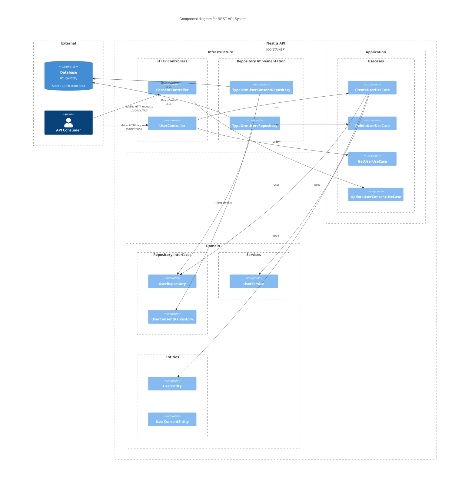

# didomi-test-preference-center-service

## Running the API

```bash
cp .env.example .env
cp .env.test.example .env.test

npm ci

docker-compose up db # In a separate terminal or --detach
npm run start:dev
```

## Tests

```bash
# all tests
$ npm run test

# unit tests
$ npm run test:unit

# integration tests
$ npm run test:e2e

# test coverage (93% line coverage 💪)
$ npm run test:cov
```

## API Docs

### Swagger Docs

<http:localhost:3001/docs>

### OpenAPI Spec

<http://localhost:3001/docs-json>

## Architecture & Design

### Architecture



### Code Design

This Nest.js application is modular monolith with a clean architecture layered architecture. Each module of the application is divided into the following layers:

- **Domain Layer**: Contains the core of the application business logic of the application. Contains entities, domain errors, repositories interfaces, and domain services.

- **Application Layer**: Contains the use cases of the application, responsible for orchestrating the domain layer and the infrastructure layer.

- **Infrastructure Layer**: Contains the implementation of the repositories interfaces, database connection, and the presentation layer (controllers). In this case, the presentation layer is implemented using Nest.js HTTP controllers and the repositories are implemented using TypeORM/PostgreSQL.

Each module is divided in the layers above.

## Modules

- **User Module**: Contains the user agregate root, and every functionality related to user.

- **Consent Module**: Contains the consent agregate root, and every functionality related to the consent actor.

- **Core Module**: Contains the shared logic of the application, like the error handling, the validation pipe, and the configuration service.
